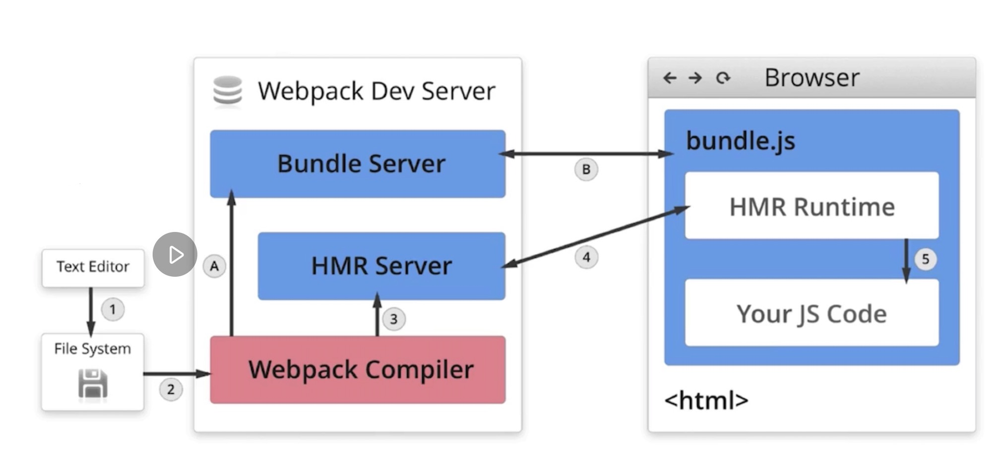

# HMR 原理

第一次运行, 文件系统会将文件交给 webpack compiler 进行编译, 然后将编译结果交给 bundle server 去执行编译好的 js 文件 (1 -> 2 -> A -> B)

当有改动时, 也就是文件系统发生了变化, 代码会通过 webpack compiler 进行编译, 然后将编译结果交给 HMR server, HMR server 会通知 (通过 websockets) HMR runtime 更新代码.
